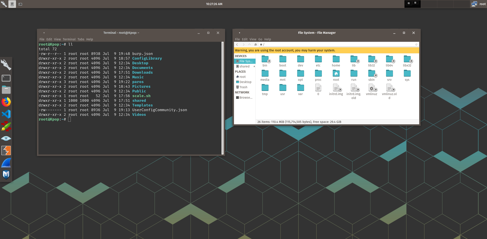

# Kali-Pop

I recently embarked on a rabbit-hole quest to setup Kali Linux with XFCE desktop for less system resource usage on my HiDPI laptop.  I also wanted a semi-consistent user experience with my host operating system ([Pop!_OS](https://system76.com/pop).

This is what I got working after a lot of trial and error and I'm pretty happy with it.



## Instructions

Re-creating this from scratch is still a work-in-progress. This repo is a rough collection of files and config that I exported.  None of this is original work or content.  

## Built with:

-XFCE Pop-Remix Theme: https://www.xfce-look.org/p/1192601/ (heavily altered for HiDPI and bug fixes)
-Pop!_OS icons
-Pop!_OS backgrounds
-fira font

## Install Kali XFCE Version
Start with a fresh install of the Kali XFCE image: https://cdimage.kali.org/kali-2019.2/kali-linux-xfce-2019.2-amd64.iso.

## Clone and Copy

```
git clone https://github.com/stevemcilwain/Kali-Pop.git

cp themes/KPop /usr/share/themes -r
cp fonts/fira /usr/share/fonts/truetype -r
cp icons/Pop /usr/share/icons
cp backgrounds /usr/share/backgrounds
cp config/xfce4/terminal/terminalrc ~.config/xfce4/terminal/terminalrc
```

## .config
You can also use the files under "config" for you home directory .config files.  I tried to copy them all once to instantly recreate my settings and it didn't work, but maybe someone can contribute and help with this.  If nothing else, you can use as reference or to shortcut some of the below steps.


## Settings Manager
Open Settings Manager and...

#### Appearance

- Style > select "KPop"
- Icons > select "Pop"
- Fonts > Default Font > "Fira Sans Book 10"
- Fonts > Default Monospace Font > "Fira Mono 11"
- Fonts > DPI > "180" (or whatever looks good for your resolution)

#### Desktop

- Background > set wallpaper using /usr/share/backgrounds
- Icons > uncheck "Default Icons" if desired

#### Window Manager

- Style > select "Kpop"
- Style > Title Font > "Fira Sans SemiBold 10"
- Window Manager > Style > Button Layout > hide all buttons except Minimize, Close (oriented on the right)
- Keyboard > I changed my Workspace hotkeys that navigate right/left to emulate up/down

#### Settings Editor

I had to do this to fix double-click on window title to maximize it...
- Settings Editor > xfwm4 > double_click_time > "1000"

## Panel Setup

For everything, leave Appearance > Style > none (use system style).

#### Panel 1 (top)

- Mode: horizontal
- leave at the top, one row
- Row Size: 64
- Length: 100%

#### Panel 1 Items

```
- Seperator
- Seperator
- Seperator
- Launcher: xfce4-appfinder
- Window Buttons: flat, group title
- Seperator: check Expand
- Clock
- Seperator: check Expand
- Launcher: screenshot
- Notification Area
- Action Buttons
- Seperator
- Seperator 
- Seperator
```

#### Panel 2 (left)

- Mode: vertical
- drag to left screen border
- Row size: 96
- Length: 40% 
- Auto increase length
- Appearance > Alpha: 50%

#### Panel 2 - Items:

```
- Seperator: check Expand
- Applications Menu (set custom Kali icon)
- Launchers (add whatever you want)
- Seperator: check Expand
```

#### Panel 3 (right)

- Mode: vertical
- Drag to the right screen border
- Row size: 128
- Length 10, auto increase
- Appearance > Alpha: 0

### Panel 3 - Items:
* if you remapped your keys to emulate vertical then this visually represents that, otherwise skip

```
- Workspace Switcher, 1 row, show miniature view
```


